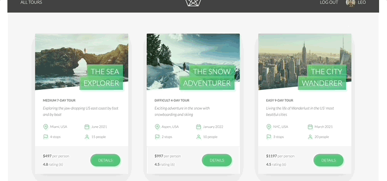
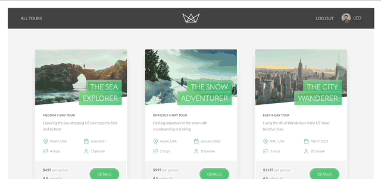

# Natours Website

## Description

The Natours Website is a dynamic web application built with Pug templates and Node.js. It provides an interactive user interface for accessing and interacting with tour data from the Natours API. Users can explore tour details, book tours, manage their bookings, and more.

## Features

- **Pug Templates**: The website utilizes Pug templates to render dynamic content populated with data retrieved from the MongoDB database.

- **User Authentication**: Users can log in, and access their personalized dashboard.

- **Tour Booking**: Authenticated users can book tours securely and make payments using Stripe integration. Booked tours are displayed in the user's dashboard. (Payment will not go through, it has been implemented, but Stripe needs more data about the business to make real transactions possible)

- **Interactive Map**: Users can view the tour stop locations on an interactive map powered by Mapbox.

- **Profile Management**: Users have the ability to set profile images, change their passwords, and manage their accounts.

## Technologies Used

- **Node.js**: The server-side logic and routing are implemented using Node.js.

- **Pug**: Pug templates are used for rendering dynamic content.

- **MongoDB**: Data is stored and managed using MongoDB, with Mongoose as the ODM.

- **Stripe**: Payment processing is handled via Stripe for secure online transactions.

- **Mapbox**: The interactive map displaying tour locations is built using Mapbox.

## Getting Started

### Prerequisites

- [Node.js](https://nodejs.org/) installed on your machine.
- [MongoDB](https://www.mongodb.com/) set up a cluster on MongoDB Atlas.

### Installation

1. **Clone the Repository:**
   First, clone the Natours Website repository by running the following commands in your terminal:

   ```bash
   git clone https://github.com/hassan-attar/natours-website.git
   cd natours-website
   ```

2. **Install Dependencies:**
   Use npm to install the required dependencies:

```bash
npm install
```

3. **Configure Environment Variables:**
   Create a `config.env` file in the root directory of the project and add the necessary environment variables. You can find `config.env.example` file with all the necessary fields. make sure to replace the placeholders with valid data.

   This step is crucial for the proper functioning of the website and its integration with external services.

4. **Run the Server**
   To run the Natours Website locally, you'll need to start the Node.js server. Open your terminal and run the following command:

```bash
npm start
```

You can run the server in development mode by using the following command:

```bash
npm run dev
```

## Project Showcase

Here's a glimpse of the Natours Website in action:

### Login, UI and Map


### Stripe checkout for a tour



### User Dashboard



## Acknowledgments

I would like to acknowledge [Jonas Schmedtmann](https://www.udemy.com/user/jonasschmedtmann/) for his outstanding course, Node.js, Express, MongoDB & More: The Complete Bootcamp 2023, which provided me with invaluable insights and knowledge. This project served as my final project for the course, where I had the opportunity to apply what I've learned in a real-world context.
